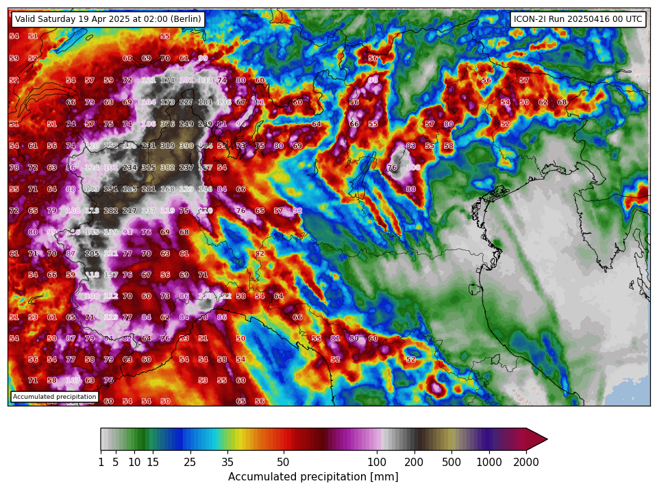
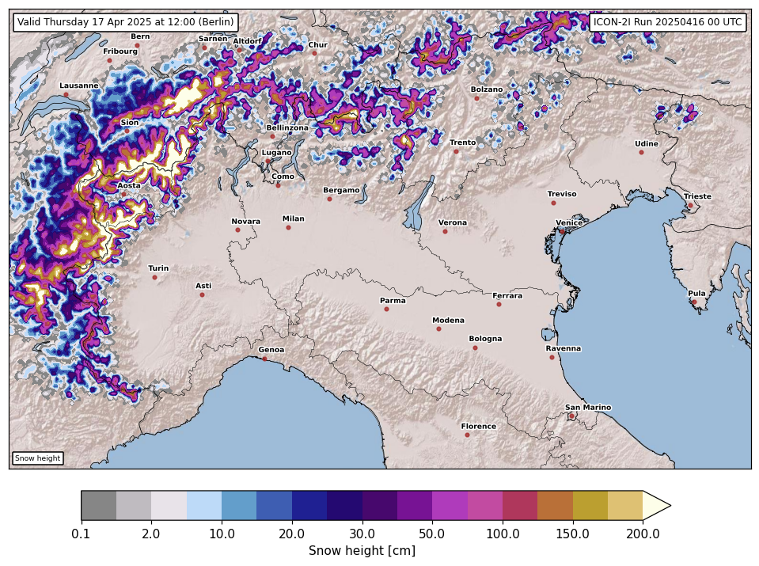

# ICON-2I plotting
This is a set of Python scripts that allows one to plot the model output from ICON-2I which can be found in https://meteohub.mistralportal.it/nwp/ICON-2I_all2km/.

Every Python script `plot_*.py` makes a different plot.
The data is directly fetched at plot time and cached using `fsspec` so there's no need to donwload the data beforehand. 
For most applications this is fine because the data to be downloaded for every plot is not large. 

## How to use
For the moment no list of dependencies is provided so you'll need to figure that out on your own.
Once everything is set up you are able to just run every script and provide some options

- `--projection` can be one of the projections keywords defined in `projections.py`
- `--debug` can be provided if you want to just see one plot instead than producing PNGs.

The default behaviour is to output one PNG per timestep in a subfolder of `images` with the name of the `projection` chosen. 
Every plot script creates file names with a prefix that depends on a plot type and a suffix that indicates the timestep of the foreacst.

In `definitions.py` some settings can be changed.

## Colormaps
In the folder `colormaps` some colormaps to be used in matplotlib are provided.
I manually created them by choosing the ones I like most. 
They are defined as list of colors in `R, G, B, A` format.
Make sure to take a look at the function `get_colormap_norm` to understand how these are used in the plots. Ideally one needs to chose levels so that you have the same numbers of colors. 

## Shapefiles
Some basic shapefiles are included in the repo so that there are no external dependencies.

